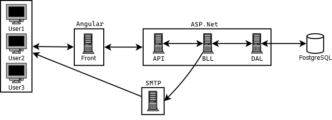

# Playzone 2024 - Gestion du temps et du budget

[👉 Accédez à la partie Frontend](https://github.com/PlayZone2024/Front)
[👉 Accédez à la partie Backend](https://github.com/PlayZone2024/API)

## Description

Ce projet a permis de digitaliser et d’automatiser avec succès la gestion des projets, des budgets et des prestations internes, améliorant ainsi l’efficacité opérationnelle de l’institut. La solution logicielle développée offre désormais une gestion transparente des coûts, des prestations et des rapports financiers, répondant pleinement aux attentes des organismes subsidiants et du secrétariat social. Voici les principaux objectifs du projet :

- **Automatiser la gestion des projets et tâches internes** : centralisation des projets, suivi des prestations, et imputation des coûts.
- **Optimiser le suivi des budgets** : prévision et suivi en temps réel des coûts, avec extraction facilitée pour les rapports aux organismes subsidiants.
- **Simplifier la gestion des prestations internes** : encodage des prestations, centralisation RH, affectation des coûts aux projets, et automatisation des données pour le pointage RH.

---

## Contributeurs

Ce projet n'aurait pas été possible sans l'implication et le travail de toutes les personnes suivantes. Merci à chacun pour sa contribution unique et précieuse.

### Business Analysts

Ces personnes ont contribué à l'analyse des besoins, la définition des fonctionnalités, et la documentation des processus métiers :

- **Alexandra Ercoli Caller** - [LinkedIn](https://www.linkedin.com/in/alexandra-ercoli-caller/)
- **Aurélie Mbiye Mujinga** - [LinkedIn](https://www.linkedin.com/in/aurélie-mbiye-mujinga/)
- **Merve Sehirli Nasir** - [LinkedIn](https://www.linkedin.com/in/merve-sehirli-nasir-phd/)
- **Etienne Botton** - [LinkedIn](https://www.linkedin.com/in/etienne-botton-a9731817/)

### Développeurs

Ces personnes ont conçu, développé et testé les fonctionnalités de ce projet :

- **Dylan Radelet** -  _Front_ - [LinkedIn](https://www.linkedin.com/in/dylan-radelet/)
- **Eva Maudoux** - _Front_ - [LinkedIn](https://www.linkedin.com/in/evamaudoux/)
- **Jérôme Tcherepachin** - _Back & Front_ - [LinkedIn](https://www.linkedin.com/in/jérôme-tchérépachin-45b148323/)
- **Louis Delleur** - _Back & Front_ - [LinkedIn](https://www.linkedin.com/in/louis-delleur/)
- **Louis Patigny** - _Back & Front_ - [LinkedIn](https://www.linkedin.com/in/louispatigny/)
- **Sébastien Dendal** - _Back_ - [LinkedIn](https://www.linkedin.com/in/sebastiendendal/)
- **Steven Hanse** - _Back_ - [LinkedIn](https://www.linkedin.com/in/steven-hanse/)

### Administrateurs Système

Ces personnes ont assuré la gestion des serveurs, la mise en place des environnements, et le bon fonctionnement des infrastructures :

- **Dylan Olivier** - [LinkedIn](https://www.linkedin.com/in/dylan-olivier/)
- **Florent Descamp** - [LinkedIn](https://www.linkedin.com/in/florent-descamps/)
- **Ilyas Hadji** - [LinkedIn](https://www.linkedin.com/in/ilyas-hadji/)
- **Jonathan Mathieu** - [LinkedIn](https://www.linkedin.com/in/jonathan-mathieu-180050329)

---

## Remerciements Spéciaux

Nous souhaitons également remercier toutes les autres personnes qui ont contribué directement ou indirectement au succès de ce projet.
